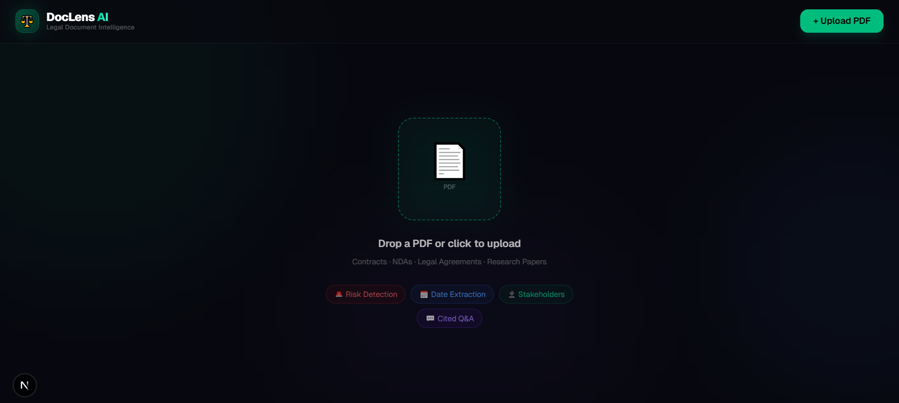

# DocLens AI - Legal Document Intelligence Platform

<p align="center">
  
  
  
  
  
</p>

<p align="center">
  <b>AI-powered legal document analysis with intelligent risk detection, date extraction, and contextual Q&A</b>
</p>



## ✨ Features

### 🔍 **Intelligent Document Analysis**
- **Risk Detection**: Automatically identifies potential risks, liabilities, and unfavorable terms
- **Date Extraction**: Finds and categorizes all important dates and deadlines
- **Stakeholder Identification**: Detects parties, signatories, and involved entities
- **Document Summary**: Generates concise executive summaries
- **Key Clause Highlighting**: Identifies and surfaces critical contract provisions

### 💬 **Smart Chat Interface**
- **Cited Q&A**: Ask questions about your document with page-number citations
- **Streaming Text**: Beautiful typewriter effect for AI responses
- **Suggested Questions**: AI-generated relevant questions based on document content
- **Context-Aware**: Answers are grounded in the actual uploaded document

### 📄 **Seamless PDF Support**
- Drag & drop file upload
- Click-to-upload functionality
- Instant text extraction and parsing
- Page count tracking

### 🎨 **Premium UI/UX**
- Dark mode glassmorphism design
- Smooth animations and transitions
- Responsive layout (desktop & mobile)
- Fixed viewport when analyzing (no unwanted scrolling)
- Real-time loading step indicators
- Beautiful typing indicators

## 🚀 Getting Started

### Prerequisites
- Node.js 18+ 
- Groq API key ([Get one free](https://console.groq.com/))

### Installation

1. **Clone the repository**
```bash
git clone https://github.com/yourusername/doclens-ai.git
cd doclens-ai
```

2. **Install dependencies**
```bash
npm install
```

3. **Set up environment variables**
```bash
cp .env.local.example .env.local
```
Edit `.env.local` and add your Groq API key:
```env
GROQ_API_KEY=your_groq_api_key_here
```

4. **Run the development server**
```bash
npm run dev
```

5. **Open** [http://localhost:3000](http://localhost:3000) in your browser

## 🛠️ Tech Stack

| Category | Technology |
|----------|------------|
| Framework | Next.js 16.2.6 (App Router) |
| Language | TypeScript 5 |
| Styling | Tailwind CSS 4 |
| AI/ML | Groq SDK + Llama 3.3 70B |
| PDF Parsing | pdf-parse |
| UI Components | Custom + Tailwind |
| Icons | Emoji + CSS |

## 📁 Project Structure

```
doclens-ai/
├── app/
│   ├── api/
│   │   ├── analyze/      # PDF analysis endpoint
│   │   └── chat/          # Chat Q&A endpoint
│   ├── globals.css        # Global styles
│   ├── layout.tsx       # Root layout
│   └── page.tsx         # Main application
├── public/              # Static assets
├── .env.local          # Environment variables
├── next.config.ts      # Next.js config
├── package.json
├── tsconfig.json
└── README.md
```

## 🔧 API Endpoints

### `POST /api/analyze`
Analyzes a PDF document and returns structured insights.

**Request**: `multipart/form-data` with PDF file

**Response**:
```json
{
  "success": true,
  "analysis": {
    "summary": "Executive summary...",
    "risks": [{"text": "Risk description", "page": "Page 3"}],
    "dates": [{"text": "Deadline", "page": "Page 2"}],
    "stakeholders": [{"text": "Party name", "page": "Page 1"}],
    "keyClause": "Important clause text..."
  },
  "suggestedQuestions": ["What is the termination clause?", ...],
  "pageCount": 10
}
```

### `POST /api/chat`
Answers questions about the uploaded document.

**Request**:
```json
{
  "question": "What are the payment terms?",
  "documentText": "Full document text..."
}
```

**Response**:
```json
{
  "answer": "The payment terms state that... (Page 5)"
}
```

## 🎯 Use Cases

- **Legal Professionals**: Quickly review contracts and agreements
- **Business Teams**: Analyze vendor contracts, NDAs, and MOUs
- **Compliance Officers**: Identify regulatory risks and deadlines
- **HR Departments**: Review employment contracts
- **Freelancers**: Understand client contracts before signing

## 📝 Environment Variables

| Variable | Description | Required |
|----------|-------------|----------|
| `GROQ_API_KEY` | Groq API key for AI inference | Yes |

## 🚢 Deployment

### Deploy to Vercel (Recommended)
[](https://vercel.com/new/clone?repository-url=https://github.com/yourusername/doclens-ai)

### Manual Deployment
```bash
npm run build
npm start
```

## 🤝 Contributing

Contributions are welcome! Please feel free to submit a Pull Request.

1. Fork the repository
2. Create your feature branch (`git checkout -b feature/AmazingFeature`)
3. Commit your changes (`git commit -m 'Add some AmazingFeature'`)
4. Push to the branch (`git push origin feature/AmazingFeature`)
5. Open a Pull Request

## 📄 License

This project is licensed under the MIT License - see the [LICENSE](LICENSE) file for details.

## 🙏 Acknowledgments

- [Groq](https://groq.com/) for ultra-fast AI inference
- [Meta](https://ai.meta.com/) for Llama 3.3 model
- [Next.js](https://nextjs.org/) team for the amazing framework
- [Tailwind CSS](https://tailwindcss.com/) for the utility-first CSS framework

---

<p align="center">
  Built with ❤️ by ZAID
</p>
